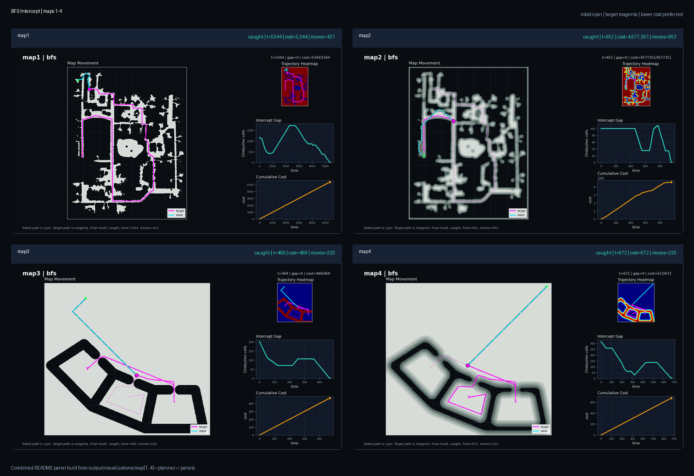
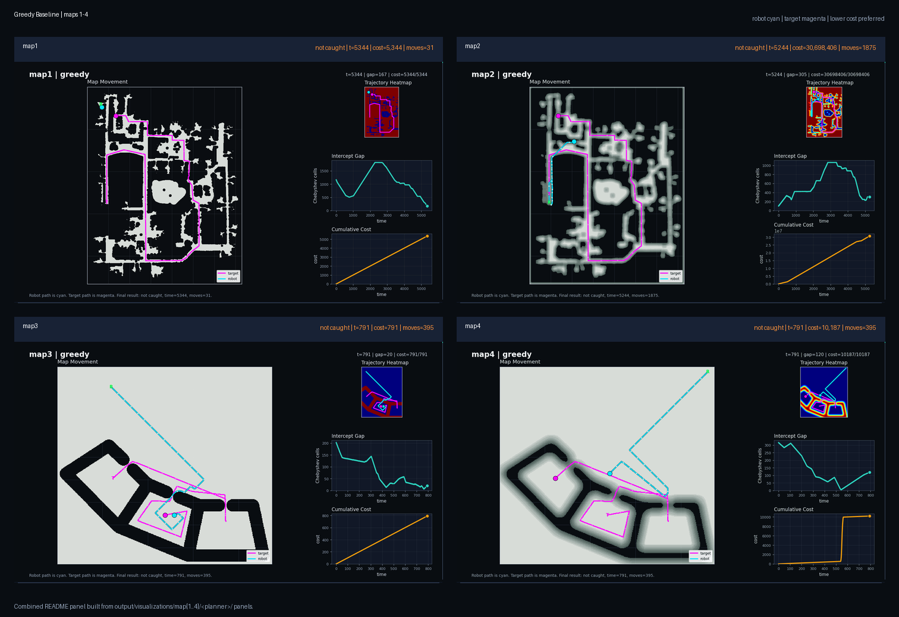

# SpatioTemporal Planning

Author: Varun Moparthi

## Abstract

This project solves a moving-target interception problem on weighted 2D grid
maps. A robot starts at a known cell, a target follows a known time-indexed
trajectory, and the planner must command one 8-connected grid action at each
control step until the robot occupies the same cell as the target. The map
contains nonuniform traversal costs and blocked cells, so a good solution must
reason about both time and space: catching the target early is not always the
same as catching it cheaply.

The project compares several graph-search views of the same interception task:
direct pursuit, spatial reachability, weighted search, explicit space-time
search, and a final hybrid strategy that selects a validated low-cost catch
trajectory. The outputs emphasize both behavior and evaluation, with animated
map panels, final trajectory panels, and tables showing catch success, time,
motion count, and weighted path cost.

## Output Gallery

### Hybrid Planner Evolution


### Multi-Goal A* Evolution


### BFS Intercept Evolution


### Direct Intercept Evolution


### Greedy Baseline Evolution


## Repository Layout

```text
.
|-- CMakeLists.txt
|-- LICENSE
|-- README.md
|-- include/
|   |-- planner.h
|   `-- planners/
|       |-- bfs_intercept.h
|       |-- direct_intercept.h
|       |-- greedy_fallback.h
|       |-- hybrid_planner.h
|       |-- multi_goal_intercept_astar.h
|       |-- space_time_astar.h
|       `-- spatial_intercept_astar.h
|-- maps/
|   |-- map1.txt
|   |-- ...
|   `-- map9.txt
|-- output/
|   |-- robot_trajectory.txt
|   `-- visualizations/
|-- paper/
|-- scripts/
|   |-- benchmark_planners.py
|   |-- render_planner_visuals.py
|   `-- visualizer.py
|-- src/
|   |-- planner.cpp
|   `-- runtest.cpp
`-- utils/
    `-- grid_utils.h
```

The core planner code is header-only except for the required `planner.cpp`
entrypoint. Shared grid indexing, collision checks, target lookup, timing, and
path scoring live in `utils/grid_utils.h`.

## Setup

From the project root:

```bash
cd /mntdatalora/src/SpatioTemporal-Planning
cmake -S . -B build
cmake --build build
```

Run the default hybrid planner:

```bash
./build/run_test map9.txt
```

Run a specific planner variant:

```bash
STP_PLANNER=multigoal ./build/run_test map9.txt
STP_PLANNER=bfs ./build/run_test map9.txt
STP_PLANNER=direct ./build/run_test map9.txt
STP_PLANNER=greedy ./build/run_test map9.txt
STP_PLANNER=spacetime ./build/run_test map9.txt
```

Available planner names:

| `STP_PLANNER` | Implementation |
| --- | --- |
| `hybrid` or unset | `HybridPlanner` |
| `multigoal` or `multi_goal` | `MultiGoalInterceptAStar` |
| `spatial` | `SpatialInterceptAStar` |
| `bfs` | `BfsInterceptPlanner` |
| `spacetime` | `SpaceTimeWeightedAStar` |
| `direct` | `DirectInterceptPlanner` |
| `greedy` | `GreedyFallbackPlanner` |

## Problem Model

Each map defines a weighted grid, a collision threshold, a robot start cell, and
a target trajectory. The harness uses 1-indexed grid coordinates. A grid
coordinate maps into the 1D map array as:

$$
\operatorname{idx}(x,y) = (y-1)x_{\mathrm{size}} + (x-1).
$$

The free-space set is:

$$
\mathcal{V}_{\mathrm{free}}
= \left\{(x,y)\;\middle|\;
1 \le x \le x_{\mathrm{size}},\;
1 \le y \le y_{\mathrm{size}},\;
0 \le c(x,y) < c_{\mathrm{obs}}
\right\}.
$$

The robot action set is the 8-connected grid neighborhood plus wait:

$$
\mathcal{U}
= \{(u_x,u_y) \mid u_x,u_y \in \{-1,0,1\}\}.
$$

The robot state and one-step action are represented by:

$$
p_t=(x_t,y_t),\qquad u_t\in\mathcal{U}.
$$

The transition model is:

$$
p_{t+1}=p_t+u_t,\qquad p_{t+1}\in\mathcal{V}_{\mathrm{free}}.
$$

The target position at time $t$ is:

$$
q_t = \operatorname{targetAt}(t).
$$

The target is caught when:

$$
p_t = q_t.
$$

Because diagonal moves are allowed, the basic lower bound on travel time is
Chebyshev distance:

$$
d_\infty(a,b) = \max\{|a_x-b_x|,\;|a_y-b_y|\}.
$$

For a candidate future intercept time, reachability must satisfy:

$$
d_\infty(p_\tau,q_t) \le t-\tau.
$$

Here $\tau$ is the current planning time. This lower bound is used throughout
the planner portfolio to reject impossible target times before doing expensive
search.

## Cost Model

The harness charges the cost of the robot's current cell for the elapsed action
duration:

$$
J = \sum_k \Delta t_k\,c(p_k).
$$

In normal runs each planner call is designed so that $\Delta t_k=1$, but the
harness still computes elapsed planning time and rounds it up. The planner
therefore has two related goals:

1. Return a valid next action quickly.
2. Follow a route whose cell costs remain low enough to avoid expensive
   high-cost terrain.

Candidate routes are compared with the same current-cell convention:

$$
J(P) = \sum_{i=0}^{n-2} c(p_i).
$$

If a candidate reaches a future intercept cell early and waits there, the
waiting cost is included as repeated cost at that cell.

## Map Inventory

| map | cells | collision threshold | robot start | target steps |
| --- | ---: | ---: | --- | ---: |
| `map1.txt` | 1825 x 2332 | 100 | `159,208` | 5345 |
| `map2.txt` | 1825 x 2332 | 6500 | `231,1369` | 5245 |
| `map3.txt` | 473 x 436 | 100 | `119,45` | 792 |
| `map4.txt` | 473 x 436 | 5000 | `459,12` | 792 |
| `map5.txt` | 200 x 200 | 100 | `25,100` | 182 |
| `map6.txt` | 200 x 200 | 100 | `100,165` | 141 |
| `map7.txt` | 400 x 400 | 50 | `350,50` | 301 |
| `map8.txt` | 400 x 400 | 50 | `50,50` | 452 |
| `map9.txt` | 400 x 400 | 50 | `50,200` | 602 |

The first two maps are very large, so the default planner avoids relying on a
single exhaustive space-time search. The smaller maps are useful for checking
whether exact or near-exact strategies behave as expected.

## Planner Entrypoint and Caching

The homework harness calls:

```cpp
void planner(
    int* map,
    int collision_thresh,
    int x_size,
    int y_size,
    int robotposeX,
    int robotposeY,
    int target_steps,
    int* target_traj,
    int targetposeX,
    int targetposeY,
    int curr_time,
    int* action_ptr);
```

The entrypoint in `src/planner.cpp` converts the raw arguments into a
`PlanningRequest`. The selected planner returns a `TimedPlan`, which is a start
time and a vector of poses:

```cpp
struct TimedPlan {
    int start_time;
    std::vector<Pose> poses;
};
```

Since the harness asks for only one action at a time, `planner.cpp` caches the
current planned route. On the next call it checks:

1. the map pointer, target trajectory pointer, dimensions, and collision
   threshold still match the cached problem;
2. the current robot pose equals the cached pose at the expected time offset;
3. the next cached pose is a valid one-step action.

If those checks pass, the planner executes the next cached action. If not, it
replans from the current robot pose and time. This keeps the control loop fast
without blindly trusting stale plans.

## Planner Details

### Hybrid Planner

`HybridPlanner` treats the available planners as a validated search portfolio.
The main idea is not to average planner outputs or trust the first returned
path. Instead, it generates candidate intercept routes, rejects any candidate
whose final robot cell does not match the target cell at the same time, and
then selects the candidate with the lowest path cost under the harness cost
model.

The portfolio is:

$$
\mathcal{P}
= \{P_{\mathrm{direct}},P_{\mathrm{multi}},P_{\mathrm{spatial}},P_{\mathrm{bfs}}\}.
$$

A candidate route is accepted only when it catches the target at its own final
time:

$$
p_{|P|-1} = q_{\tau + |P| - 1}.
$$

The selected route is the minimum-cost valid member of that set:

$$
P^\star
= \arg\min_{P \in \mathcal{P}\;:\;\mathrm{valid}(P)} J(P).
$$

If no portfolio candidate catches the target, the planner tries explicit
space-time weighted A*. If that also fails, it returns a valid greedy one-step
action so the harness never receives an invalid command.


| map | caught | time | moves | cost | wall_s |
| --- | ---: | ---: | ---: | ---: | ---: |
| `map1` | 1 | 3882 | 1509 | 3882 | 2.497 |
| `map2` | 1 | 4672 | 1235 | 4451784 | 2.376 |
| `map3` | 1 | 241 | 241 | 241 | 0.717 |
| `map4` | 1 | 379 | 266 | 379 | 1.166 |
| `map5` | 1 | 150 | 150 | 2551 | 0.570 |
| `map6` | 1 | 88 | 87 | 1522 | 0.721 |
| `map7` | 1 | 250 | 250 | 250 | 0.941 |
| `map8` | 1 | 431 | 430 | 431 | 1.625 |
| `map9` | 1 | 368 | 367 | 368 | 1.297 |

### Multi-Goal Intercept A*

`MultiGoalInterceptAStar` searches toward all reachable future target cells at
once. A target cell becomes a useful goal only if the robot can arrive no later
than at least one time when the target occupies that cell.

For a candidate cell, define the target visit times:

$$
\mathcal{T}(v)=\{t \mid q_t=v\}.
$$

The reachable future goal set is:

$$
\mathcal{G}
= \left\{v\;\middle|\;
\exists t \in \mathcal{T}(v),\;
d_\infty(p_\tau,v) \le t-\tau,\;
v \in \mathcal{V}_{\mathrm{free}}
\right\}.
$$

For an expanded cell, the earliest compatible intercept time is:

$$
t_I(v)
= \min\left\{t \in \mathcal{T}(v)
\;\middle|\;
t \ge \tau+d_P(v)
\right\},
$$

where $d_P(v)$ is the number of steps in the recovered path to $v$. The final
candidate score includes both travel and waiting:

$$
J(v)
= g(v) + \bigl(t_I(v)-\tau-d_P(v)\bigr)c(v).
$$

The heuristic blends distance to the target trajectory's bounding box with
distance to sampled target cells:

$$
h(v)
= c_{\min}\left(0.35\,d_{\mathrm{box}}(v)
+0.65\,d_{\mathrm{sample}}(v)\right).
$$


| map | caught | time | moves | cost | wall_s |
| --- | ---: | ---: | ---: | ---: | ---: |
| `map1` | 1 | 3882 | 1509 | 3882 | 4.371 |
| `map2` | 1 | 4672 | 1235 | 4451784 | 3.023 |
| `map3` | 1 | 321 | 321 | 321 | 0.655 |
| `map4` | 1 | 379 | 266 | 379 | 0.626 |
| `map5` | 1 | 175 | 175 | 3115 | 0.271 |
| `map6` | 1 | 88 | 87 | 1522 | 0.269 |
| `map7` | 1 | 250 | 250 | 250 | 0.307 |
| `map8` | 1 | 431 | 430 | 431 | 0.493 |
| `map9` | 1 | 368 | 367 | 368 | 0.933 |

### BFS Intercept Planner

`BfsInterceptPlanner` searches the spatial grid with uniform edge cost. It is
therefore a reachability planner: it finds the minimum number of 8-connected
moves to each cell, then checks whether the target reaches that cell at or
after the robot can arrive.

The BFS distance from start cell $s$ to cell $v$ is:

$$
d_G(s,v)=\min_{P:s\to v} |P|-1.
$$

A cell is a valid interception site when:

$$
\exists t \in \mathcal{T}(v)
\quad \mathrm{s.t.}\quad
t \ge \tau+d_G(s,v).
$$

This planner is complete for spatial reachability on the free grid, but it does
not minimize weighted map cost. That distinction is why it can catch early while
still paying more cost than hybrid or multi-goal A*.



| map | caught | time | moves | cost | wall_s |
| --- | ---: | ---: | ---: | ---: | ---: |
| `map1` | 1 | 5344 | 421 | 5344 | 2.217 |
| `map2` | 1 | 952 | 952 | 4577351 | 1.979 |
| `map3` | 1 | 469 | 220 | 469 | 0.196 |
| `map4` | 1 | 672 | 225 | 672 | 0.508 |
| `map5` | 1 | 150 | 150 | 2551 | 0.127 |
| `map6` | 1 | 140 | 0 | 2800 | 0.358 |
| `map7` | 1 | 150 | 150 | 2550 | 0.381 |
| `map8` | 1 | 451 | 410 | 451 | 0.169 |
| `map9` | 1 | 300 | 300 | 2676 | 0.215 |

### Direct Intercept Planner

`DirectInterceptPlanner` is a straight-line pursuit baseline. It scans future
target times and first checks whether the target cell is reachable under the
Chebyshev lower bound:

$$
d_\infty(p_\tau,q_t) \le t-\tau.
$$

When the time bound is feasible, the route steps directly toward the candidate
target cell:

$$
p_{k+1}
= p_k+
\begin{bmatrix}
\operatorname{sgn}(q_{t,x}-p_{k,x})\\
\operatorname{sgn}(q_{t,y}-p_{k,y})
\end{bmatrix}.
$$

The candidate is rejected if any intermediate cell is blocked:

$$
p_k \in \mathcal{V}_{\mathrm{free}}
\qquad \forall k\in[\tau,t].
$$

This planner is intentionally simple. It is useful for identifying cases where
the target can be caught by direct pursuit, but it fails when obstacle geometry
or high-cost terrain requires a detour.


| map | caught | time | moves | cost | wall_s |
| --- | ---: | ---: | ---: | ---: | ---: |
| `map1` | 0 | 5344 | -1 | 5344 | 5.087 |
| `map2` | 0 | 5244 | -1 | 17682768 | 6.881 |
| `map3` | 1 | 241 | 241 | 241 | 0.187 |
| `map4` | 1 | 287 | 286 | 135257 | 0.297 |
| `map5` | 1 | 150 | 150 | 5050 | 0.124 |
| `map6` | 1 | 70 | 70 | 3050 | 0.225 |
| `map7` | 1 | 150 | 150 | 2550 | 0.186 |
| `map8` | 0 | 451 | -1 | 451 | 0.286 |
| `map9` | 1 | 300 | 300 | 5100 | 0.451 |

### Greedy Fallback Planner

`GreedyFallbackPlanner` chooses one valid neighboring cell at a time. It
prioritizes getting closer to the target's next position and only uses map cost
as a tie-breaker:

$$
S(v)=10^6d_1(v,q_{\tau+1})+c(v).
$$

The selected next pose is:

$$
p_{\tau+1}
= \arg\min_{v \in \mathcal{N}_8(p_\tau)\cap\mathcal{V}_{\mathrm{free}}} S(v).
$$

This planner is fast and locally safe, but it does not reason about future
target motion, waiting, or obstacle detours. Its low complexity makes it a good
fallback and a useful lower baseline in the evaluation.



| map | caught | time | moves | cost | wall_s |
| --- | ---: | ---: | ---: | ---: | ---: |
| `map1` | 0 | 5344 | 31 | 5344 | 1.855 |
| `map2` | 0 | 5244 | 1875 | 30698406 | 2.224 |
| `map3` | 0 | 791 | 395 | 791 | 0.202 |
| `map4` | 0 | 791 | 395 | 10187 | 0.411 |
| `map5` | 0 | 181 | 90 | 6551 | 0.143 |
| `map6` | 1 | 93 | 47 | 3780 | 0.539 |
| `map7` | 0 | 300 | 150 | 5124 | 0.412 |
| `map8` | 0 | 451 | 224 | 451 | 0.229 |
| `map9` | 1 | 599 | 300 | 10199 | 0.205 |

### Supporting Search Variants

The hybrid planner also contains two supporting search variants that are useful
inside the portfolio.

`SpaceTimeWeightedAStar` searches explicit space-time states. A transition from
$(v,t)$ to $(v',t+1)$ accumulates the cost of the current cell:

$$
g(v',t+1)=g(v,t)+c(v).
$$

Its weighted A* priority is:

$$
f(v,t)=g(v,t)+w\,h(v,t),
\qquad w=2.2.
$$

The moving-target heuristic samples future target positions and penalizes
states that cannot physically intercept within the sampled time offset:

$$
h(v,t)
= c_{\min}\min_{\Delta\in\mathcal{D}_t}
\left[
d_\infty(v,q_{t+\Delta})
+4\max\left(0,d_\infty(v,q_{t+\Delta})-\Delta\right)
\right].
$$

`SpatialInterceptAStar` first selects feasible candidate intercepts and then
plans to those cells in the spatial graph:

$$
\mathcal{C}
= \left\{(q_t,t)\;\middle|\;
d_\infty(p_\tau,q_t)\le t-\tau,\;
q_t\in\mathcal{V}_{\mathrm{free}}
\right\}.
$$

For each candidate, travel and waiting are scored together:

$$
J(q_t,t)=J_{\mathrm{travel}}(q_t)
+\bigl(t-\tau-d_P(q_t)\bigr)c(q_t).
$$

## Evaluation

The current results below were generated from:

```bash
python3 scripts/render_planner_visuals.py \
  --maps map1.txt map2.txt map3.txt map4.txt map5.txt map6.txt map7.txt map8.txt map9.txt \
  --planners hybrid multigoal bfs direct greedy \
  --frames 20 \
  --duration-ms 85 \
  --timeout-s 60 \
  --map-style planner
```

The script runs each planner, captures the resulting robot trajectory, writes
per-planner metrics, and renders visualization artifacts under:

```text
output/visualizations/<map>/<planner>/
```

Each planner folder contains:

- `animated_panel.gif`
- `final_panel.png`
- `trajectory.csv`
- `metrics.json`
- `run_output.txt`

Each map folder also contains `summary.csv` and `summary.md`.

### Planner Summary

| planner | caught maps | failed maps | total cost on caught maps | mean caught time | mean wall_s |
| --- | ---: | --- | ---: | ---: | ---: |
| `hybrid` | 9/9 | none | 4461408 | 1162.3 | 1.323 |
| `multigoal` | 9/9 | none | 4462052 | 1174.0 | 1.216 |
| `bfs` | 9/9 | none | 4594864 | 958.7 | 0.683 |
| `direct` | 6/9 | map1, map2, map8 | 151248 | 199.7 | 1.525 |
| `greedy` | 2/9 | map1, map2, map3, map4, map5, map7, map8 | 13979 | 346.0 | 0.691 |

The `total cost on caught maps` column should be interpreted carefully for
planners that miss maps. For example, `greedy` has a small caught-map total only
because it catches just two maps. The most important first-order metric is
whether the planner catches the target on all maps. Among complete planners in
this evaluation, `hybrid` gives the lowest total cost.

## Visualization Assets

The visualization script renders a dashboard for each run. The current panel
layout contains:

1. Main map movement view with robot path in cyan and target path in magenta.
2. Trajectory heatmap focus panel.
3. Intercept gap plot over time.
4. Cumulative cost plot over time.

Example output paths:

```text
output/visualizations/map9/hybrid/animated_panel.gif
output/visualizations/map9/hybrid/final_panel.png
output/visualizations/map9/hybrid/metrics.json
output/visualizations/map9/summary.md
output/visualizations/readme_panels/hybrid_maps1_4_animated_panel.gif
output/visualizations/readme_panels/hybrid_maps1_4_final_panel.png
```

The README-level panels are built by `scripts/build_readme_visual_panels.py`.
They combine the existing per-map panels into method-level `map1`-`map4`
dashboards for the top gallery.

## Reproducing Evaluation

Build first:

```bash
cmake -S . -B build
cmake --build build
```

Run a single case:

```bash
STP_PLANNER=hybrid ./build/run_test map9.txt
```

Run comparison benchmarks:

```bash
python3 scripts/benchmark_planners.py \
  --maps map1.txt map2.txt map3.txt map4.txt map5.txt map6.txt map7.txt map8.txt map9.txt \
  --planners hybrid multigoal bfs direct greedy \
  --timeout-s 60
```

Render visualizations:

```bash
python3 scripts/render_planner_visuals.py \
  --maps map1.txt map2.txt map3.txt map4.txt map5.txt map6.txt map7.txt map8.txt map9.txt \
  --planners hybrid multigoal bfs direct greedy \
  --frames 20 \
  --duration-ms 85 \
  --timeout-s 60 \
  --map-style planner
```

The last command writes the per-map summaries used in this README.

Build the combined README panels:

```bash
python3 scripts/build_readme_visual_panels.py \
  --planners hybrid multigoal bfs direct greedy \
  --frames 20 \
  --duration-ms 85
```

## License

This project is released under the [MIT License](LICENSE).

Copyright (c) 2026 Varun Moparthi.
